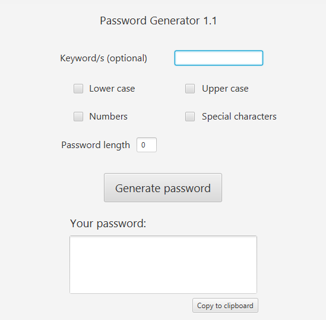
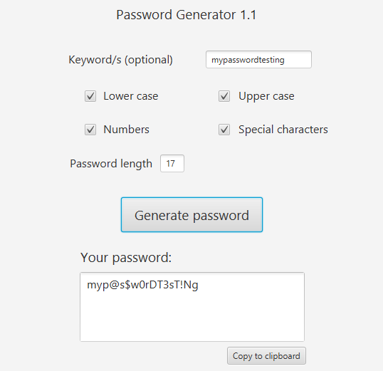

Idiomas: [English](README.md) | **Español**

<div align="center">

# Password Generator

**Una aplicación de escritorio para crear contraseñas personalizadas.**

Elige los tipos de caracteres, indica la longitud y genera una contraseña. También puedes partir de una palabra clave y copiar el resultado al portapapeles.

[Descargar para Windows](https://raw.githubusercontent.com/guilleWR/java-password-generator/main/downloads/PasswordGenerator-Windows-x64.zip) · [Cómo se usa](#cómo-se-usa)

</div>

## Funciones

| Función | Descripción |
| --- | --- |
| Tipos de caracteres | Incluye minúsculas, mayúsculas, números y caracteres especiales. |
| Longitud | Elige el tamaño cuando generas una contraseña sin palabra clave. |
| Palabra clave opcional | Transforma caracteres similares según las opciones seleccionadas. |
| Portapapeles | Copia la contraseña generada con un clic. |

## Capturas

| Ventana principal | Contraseña generada |
| :---: | :---: |
|  |  |

## Tecnologías

<p>
  
  &nbsp;&nbsp;&nbsp;
  
</p>

Java 21 · JavaFX 21 · Maven · FXML · CSS · jpackage

El proyecto usa **Maven** para gestionar las dependencias y **`jpackage`** para empaquetar el ejecutable de Windows con su propio runtime.

## Descargar y ejecutar en Windows

1. [Descarga el ZIP para Windows x64](https://raw.githubusercontent.com/guilleWR/java-password-generator/main/downloads/PasswordGenerator-Windows-x64.zip).
2. Extrae **todo** el ZIP.
3. Abre `PasswordGenerator/PasswordGenerator.exe` dentro de la carpeta extraída.

**No necesitas instalar Java ni JavaFX.** El ZIP contiene la aplicación y su runtime de Java. Conserva juntos el `.exe`, `app` y `runtime`: el `.exe` por sí solo no funciona.

## Cómo se usa

1. Marca al menos un tipo de carácter: minúsculas, mayúsculas, números o caracteres especiales.
2. Si no vas a usar una palabra clave, escribe la longitud deseada.
3. Opcionalmente, escribe una palabra clave. La aplicación transforma los caracteres cuando hay una sustitución similar compatible con tus opciones; si no la hay, conserva el carácter original. En este modo, el resultado tiene la longitud de la palabra clave.
4. Pulsa **Generate password** y luego **Copy to clipboard** si quieres copiarla.

## Compilar desde el código

Necesitas **Windows** y **JDK 21** (por ejemplo, [Eclipse Temurin 21](https://adoptium.net/temurin/releases/?version=21)). Maven Wrapper descarga Maven y las dependencias de JavaFX durante la primera compilación.

```powershell
git clone https://github.com/guilleWR/java-password-generator.git
cd java-password-generator
powershell -ExecutionPolicy Bypass -File .\build-exe.ps1
```

El resultado estará en `dist/PasswordGenerator/PasswordGenerator.exe`. Antes de ejecutar de nuevo el script, renombra o elimina la carpeta `dist/PasswordGenerator` anterior. Para actualizar el ZIP descargable después de compilar, comprime la carpeta completa `dist/PasswordGenerator` y sustituye `downloads/PasswordGenerator-Windows-x64.zip`.
